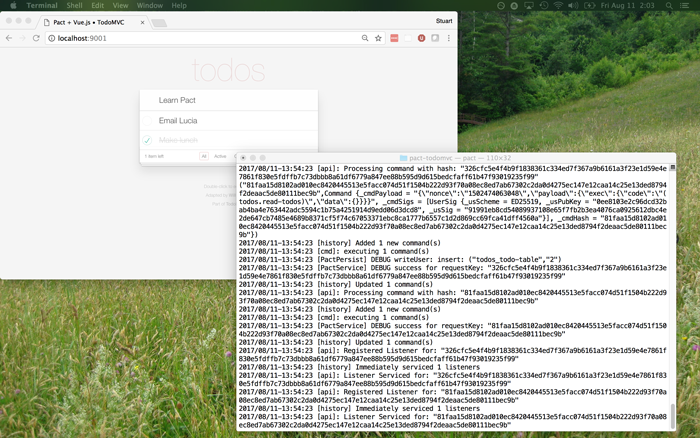

# Pact Smart Contract Language TodoMVC demo



## Setup

- Install Pact
- Install Node >= 8.11.4
- `mkdir log`

## Scripts

`npm run start:pact`: Start the Pact Server

`npm run pact:seed`: Seed the blockchain

`npm run start:dev`: Start the Webpack Dev Server

`npm run test`: Run Jest

`npm run test:snapshots`: Update Jest Snapshots

`npm run lint`: Run ESLint

`npm run prettier`: Run Prettier

## Starting the Project

1. `npm run start:dev`
2. `npm run start:pact`
3. `npm run pact:seed`
4. `http://localhost:8081`

## Using the Pact Dev Server

### Configuration File

The pact dev server (pact-serve) requires a configuration Yaml file (e.g. server.conf) to operate. The documentation for it is:

```
➜  pact git:(feat/dev-server) pact --serve --help
Config file is YAML format with the following properties:
port       - HTTP server port
persistDir - Directory for database files.
             If ommitted, runs in-memory only.
logDir     - Directory for HTTP logs
pragmas    - SQLite pragmas to use with persistence DBs
verbose    - [True|False] Provide extra logging information
```

### Initializing the server

When running pact-serve with persistence enabled the development server will automatically replay from disk when it starts.
In this demo, we are persisting to `log/` which causes pact-serve to create or use `log/commands.sqlite` to store Commands and CommandResults.

The first time you run pact-serve the SQLite DBs will be created empty (as no commands have been run yet).
To upload `todos.pact`, which the front end needs loaded to interact with, you run `initialize-todos.sh`.
The important thing to note is that until you delete `log/commands.sqlite` (or run pact-serve in memory) pact-serve will replay every command (e.g. load `todos.pact` -> UI interactions) on start up.

If you think of it like a blockchain, deleting the `commands.sqlite` file or running in memory gives Pact a "fresh" chain to work with.

## Credit

This original Vue.js TodoMVC application was created by [Evan You](http://evanyou.me).
